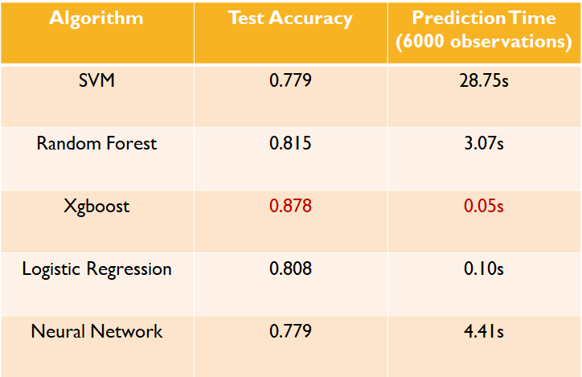
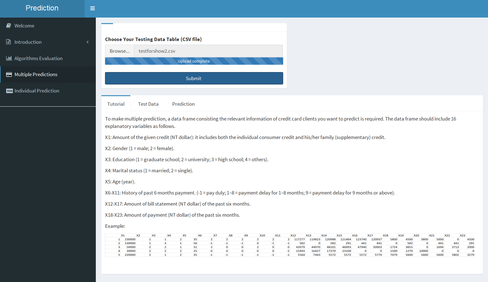
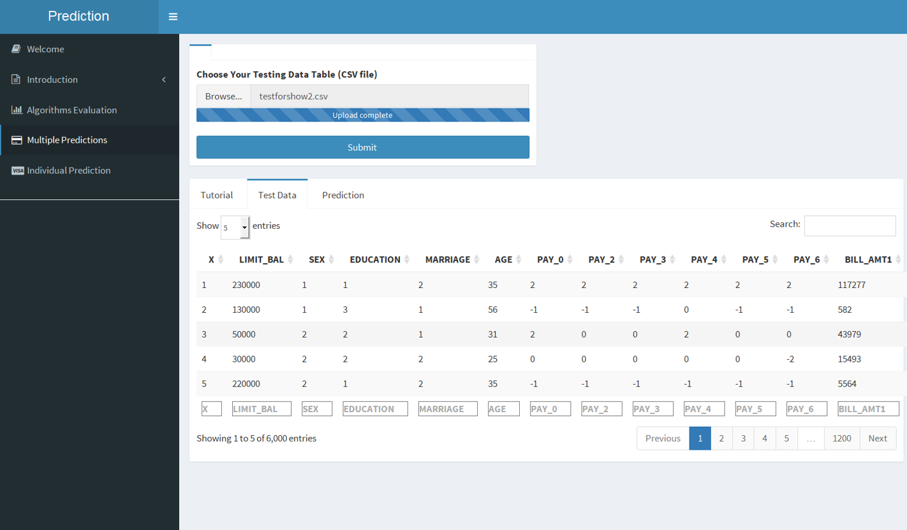
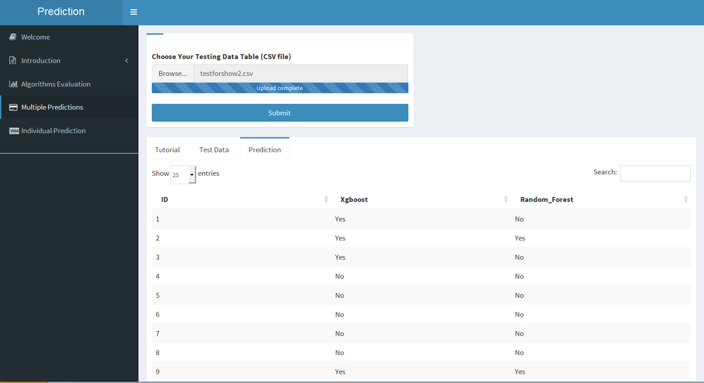
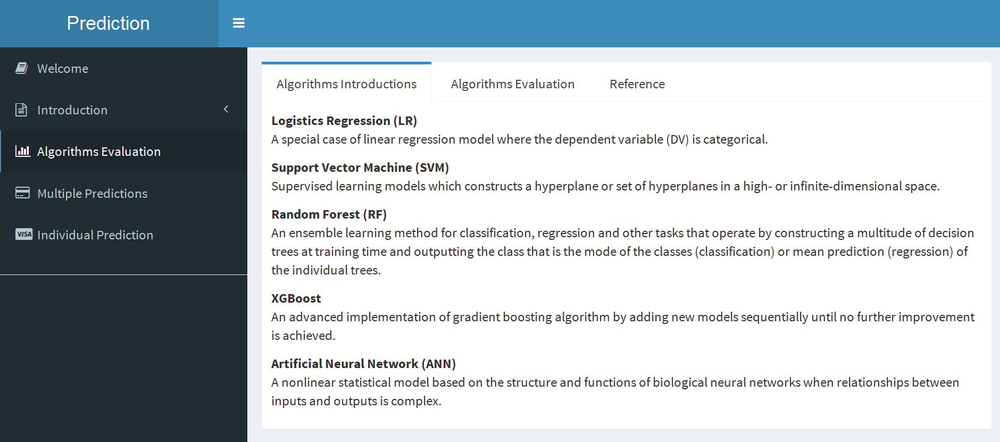
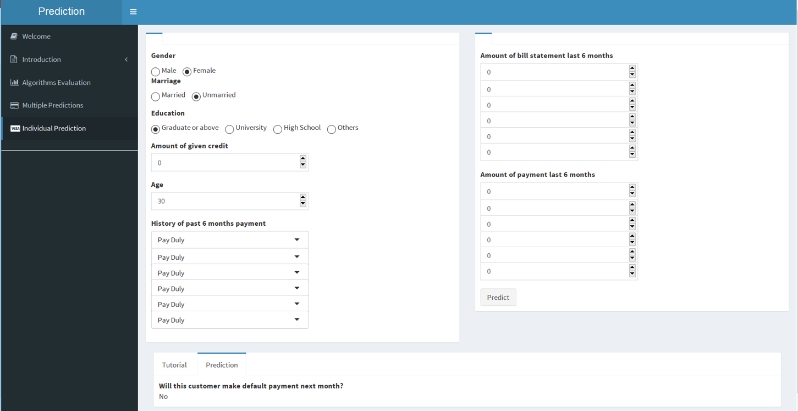

# ADS Project 5: 

Term: Spring 2018

+ Team # 8
+ Projec title: Credit Risk Modeling using Machine Learning Techniques and its Data Visualization
+ Team members
	Chenfei Jiang
	Michael Utomo
	Jingtian Yao

+ Project summary: In this project, we created a model to give credict card default prediction based on five different algorithms: Logistic Regression, Support Vector Machine, Random Forest, Xgboost and Neural Network. After conducting model selection and evaluation; by comparing the prediction accuracy as well as the computation time, the Xgboost model outperforms all others as shown below.



    Also, a Shiny App was build for our potential customers(e.g.bank and insurance company) to help them predict whether a credit card client will default in the next month.

Our app includes three main components. Intro gives you a general idea of how this app works. Prediction is the core function interface where two types of predictions (individual and multiple) are provided. Given the requested information of certain credit card client, the default payment prediction (Yes = 1, No = 0) will be made. Appendix provides more detailed description about the technical part. Principles of 5 different algorithms employed and the performance comparison between them are illustrated; while reference and the original data source are given as well.

website https://lanceyjtcolumbia.shinyapps.io/default_payment/

home page


multiple prediction page




algorithms evaluation page


individual prediction page

 
Data Source : https://archive.ics.uci.edu/ml/datasets/default+of+credit+card+clients
	
**Contribution statement**: ([default](doc/a_note_on_contributions.md)) All team members contributed equally in all stages of this project. All team members approve our work presented in this GitHub repository including this contributions statement. 

Chenfei Jiang:
Michael Utomo:
Jingtian Yao:


Following [suggestions](http://nicercode.github.io/blog/2013-04-05-projects/) by [RICH FITZJOHN](http://nicercode.github.io/about/#Team) (@richfitz). This folder is orgarnized as follows.

```
proj/
├── lib/
├── data/
├── doc/
├── figs/
└── output/
```

Please see each subfolder for a README file.
